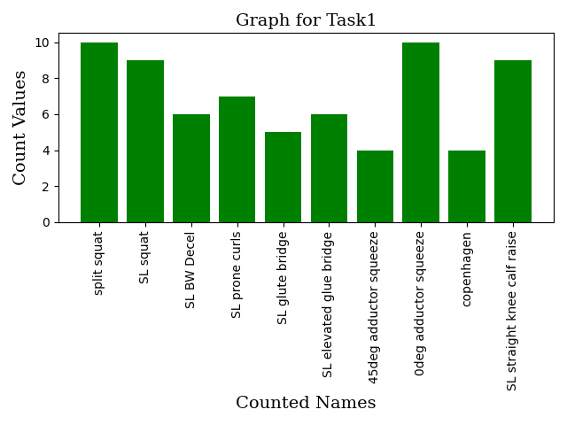

# Task1 Solution Explanation

## How I solved this task
- Firstly, I read "names.json" file, and stored the information of this file in a dictionary by modifying information a little bit. For reading "names.json" file I used json module. Keys of this dictionary are numbers which start from 0 to (total number of names -1). Values of this dictionary are names. Name of this dictionary is "names" dictionary.
<br/>
- Secondly, I read "data.pkl" file and stored it in a dataframe by using pandas module. Then I initialized "tasksSection" variable which points to task column of the dataframe. By using this variable I iterated,and I changed 1 values in the task column of the dataframe with the values in "names" dictionary orderly according to a rule. The rule is that  when 1 values start to appear, I chose the next name value and assigned this name instead of 1 values until I see a  0 value.
<br/> 
- Thirdly, I saved the last form of the dataframe to "data.pkl" file. I mean I changed the content of "data.pkl" file with my pandas dataframe.
<br/>
-  Fourthly, I benefitted "names" and "tasksSection" variables which I mentioned in early steps. I created a new dictionary, which includes names as key values and initially 0 number as values. I assigned values of "names" dictionary to keys of my new dictionary by iterating in "names" dictionary values. Then I iterated in task column and when I faced any name, I increased word count of the the name which I faced by 1. The name of this new dictionary is "countsDictionary".
<br/>
- Finally, I drew bar graph by using names and counted names values. I used matplotlib module for drawing the graph. I benefitted "countsDictionary" and I stored key values of this dictionary in an array and I stored values of this dictionary in another array. And I drew the graph.


## How I can execute "task1Solution.py" file
This pyhton file uses pandas and matplotlib module. So for running this script you must have these modules. If you don't have these modules, you can download these modules by using PyPI. Open your terminal and run the commands below orderly.
```
    pip install pandas
    pip install matplotlib
```
If you downloaded these modules you can run "task1Solution.py" file. Simply go to the place where this file locates in terminal and run the command below in your terminal.
```
    py task1Solution.py
```

